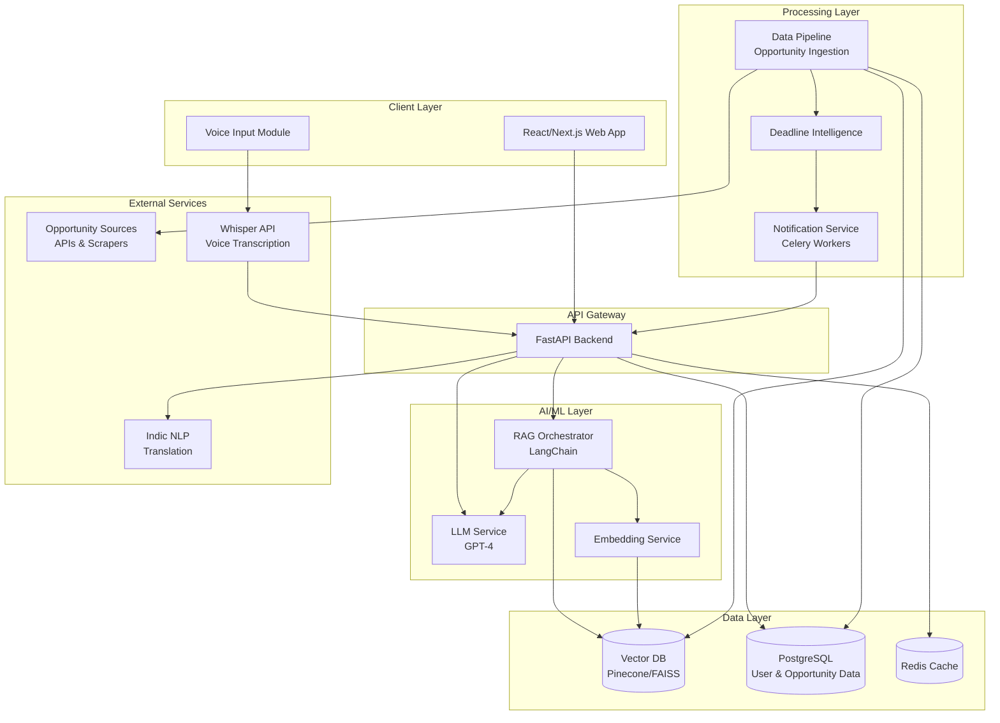

# Design Document: Opportunity Copilot

## Overview

Opportunity Copilot is an AI-powered platform that helps students across India discover and apply for relevant opportunities including hackathons, internships, scholarships, and research programs. The platform uses semantic search, large language models, and RAG (Retrieval-Augmented Generation) to provide personalized matching, eligibility assessment, and application guidance with multilingual support.

### Key Design Goals

1. **Semantic Understanding**: Use vector embeddings and RAG to understand student profiles and opportunity requirements beyond keyword matching
2. **Explainable AI**: Provide clear reasoning for eligibility scores and recommendations
3. **Multilingual First**: Support voice and text interaction in 8+ Indian languages
4. **Scalability**: Handle thousands of concurrent users and millions of opportunities
5. **Real-time Intelligence**: Provide instant matching and deadline tracking

### Technology Stack

- **Frontend**: React with Next.js for server-side rendering
- **Backend API**: FastAPI for high-performance async endpoints
- **LLM Layer**: OpenAI GPT-4 or similar for reasoning and generation
- **RAG Orchestration**: LangChain for retrieval-augmented generation workflows
- **Vector Database**: Pinecone or FAISS for semantic search
- **Primary Database**: PostgreSQL for structured data (users, opportunities, applications)
- **Multilingual NLP**: Indic NLP libraries and OpenAI Whisper for voice transcription
- **Caching**: Redis for session management and frequently accessed data
- **Message Queue**: Celery with Redis for async tasks (notifications, data processing)

## Architecture


### System Architecture Diagram



### Architecture Layers

1. **Client Layer**: React/Next.js web application with voice input capabilities
2. **API Gateway**: FastAPI handles all HTTP requests with async support
3. **AI/ML Layer**: LLM service, RAG orchestrator, and embedding generation
4. **Data Layer**: Vector database for semantic search, PostgreSQL for structured data, Redis for caching
5. **Processing Layer**: Background workers for data ingestion, notifications, and deadline tracking
6. **External Services**: Opportunity data sources, voice transcription, and translation services


## Components and Interfaces

### 1. Student Profile Service

**Responsibility**: Manage student profiles, resume parsing, and profile updates.

**Key Operations**:
```python
create_profile(student_data: StudentProfile) -> ProfileID
update_profile(profile_id: ProfileID, updates: ProfileUpdate) -> ProfileID
parse_resume(file: UploadedFile) -> ExtractedProfile
get_profile(profile_id: ProfileID) -> StudentProfile
generate_profile_embedding(profile: StudentProfile) -> Vector
```

**Data Model**:
```python
StudentProfile:
  - id: UUID
  - name: String
  - email: String
  - education: List[Education]
  - skills: List[String]
  - interests: List[String]
  - career_goals: String
  - experience: List[Experience]
  - projects: List[Project]
  - preferred_language: LanguageCode
  - created_at: Timestamp
  - updated_at: Timestamp
```

**Dependencies**: PostgreSQL, Embedding Service, Resume Parser

### 2. Opportunity Ingestion Service

**Responsibility**: Aggregate opportunities from multiple sources, validate, and store them.

**Key Operations**:
```python
ingest_opportunity(source: DataSource, raw_data: Dict) -> OpportunityID
validate_opportunity(data: Dict) -> ValidationResult
store_opportunity(opportunity: Opportunity) -> OpportunityID
generate_opportunity_embedding(opportunity: Opportunity) -> Vector
schedule_deadline_tracking(opportunity_id: OpportunityID, deadline: Date) -> None
```

**Data Model**:
```python
Opportunity:
  - id: UUID
  - title: String
  - description: String
  - organization: String
  - type: OpportunityType  # hackathon, internship, scholarship, research, summit
  - requirements: List[String]
  - benefits: List[String]
  - deadline: Date
  - location: String
  - eligibility_criteria: Dict
  - application_url: String
  - source: String
  - created_at: Timestamp
  - updated_at: Timestamp
```

**Dependencies**: PostgreSQL, Vector DB, Deadline Intelligence Service

### 3. Semantic Matching Service

**Responsibility**: Match students to opportunities using semantic search and ranking.

**Key Operations**:
```python
find_matches(profile_id: ProfileID, filters: SearchFilters) -> List[OpportunityMatch]
semantic_search(query_vector: Vector, filters: Dict, top_k: int) -> List[OpportunityID]
rank_opportunities(profile: StudentProfile, opportunities: List[Opportunity]) -> List[RankedOpportunity]
calculate_relevance_score(profile: StudentProfile, opportunity: Opportunity) -> float
```

**Data Model**:
```python
OpportunityMatch:
  - opportunity_id: UUID
  - relevance_score: float  # 0.0 to 1.0
  - match_reasons: List[String]
  - opportunity_summary: OpportunitySummary
```

**Dependencies**: Vector DB (Pinecone/FAISS), RAG Orchestrator, Profile Service

### 4. Eligibility Reasoning Engine

**Responsibility**: Calculate eligibility scores and provide natural language explanations.

**Key Operations**:
```python
calculate_eligibility(profile: StudentProfile, opportunity: Opportunity) -> EligibilityResult
generate_reasoning(profile: StudentProfile, opportunity: Opportunity, score: float) -> String
identify_matching_criteria(profile: StudentProfile, requirements: List[String]) -> MatchAnalysis
explain_score_factors(analysis: MatchAnalysis) -> List[ScoreFactor]
```

**Data Model**:
```python
EligibilityResult:
  - score: float  # 0 to 100
  - reasoning: String  # "Why this is for you" explanation
  - positive_factors: List[ScoreFactor]
  - negative_factors: List[ScoreFactor]
  - confidence: float

ScoreFactor:
  - factor: String
  - impact: float  # -1.0 to 1.0
  - explanation: String
```

**Implementation Approach**:
- Use LLM with structured prompts to analyze profile against requirements
- Extract explicit criteria matches (education level, skills, location)
- Use RAG to retrieve similar successful applications for context
- Generate natural language explanation using LLM
- Cache results for 24 hours to reduce LLM calls

**Dependencies**: LLM Service, RAG Orchestrator, Profile Service


### 5. Profile Gap Analyzer

**Responsibility**: Identify gaps in student profiles and generate improvement roadmaps.

**Key Operations**:
```python
analyze_gaps(profile: StudentProfile, opportunity: Opportunity) -> GapAnalysis
generate_improvement_roadmap(gaps: GapAnalysis) -> ImprovementRoadmap
prioritize_suggestions(suggestions: List[Suggestion], profile: StudentProfile) -> List[Suggestion]
estimate_impact(suggestion: Suggestion, opportunity: Opportunity) -> float
track_improvement(profile_id: ProfileID, suggestion_id: SuggestionID) -> None
```

**Data Model**:
```python
GapAnalysis:
  - skill_gaps: List[SkillGap]
  - experience_gaps: List[ExperienceGap]
  - education_gaps: List[EducationGap]
  - project_gaps: List[ProjectGap]

ImprovementRoadmap:
  - suggestions: List[Suggestion]
  - estimated_timeline: String
  - priority_order: List[SuggestionID]

Suggestion:
  - id: UUID
  - type: GapType
  - title: String
  - description: String
  - estimated_impact: float  # Expected eligibility score increase
  - estimated_effort: String  # "1 week", "1 month", etc.
  - resources: List[String]  # Links to courses, tutorials, etc.
```

**Implementation Approach**:
- Compare profile attributes with opportunity requirements
- Use LLM to identify implicit gaps (e.g., "leadership experience" when profile shows only technical skills)
- Rank gaps by impact on eligibility score
- Generate actionable suggestions with resources
- Track which suggestions students act on

**Dependencies**: LLM Service, Eligibility Reasoning Engine, Profile Service

### 6. Application Guidance Service

**Responsibility**: Generate personalized application checklists and track progress.

**Key Operations**:
```python
generate_checklist(profile: StudentProfile, opportunity: Opportunity) -> ApplicationChecklist
update_checklist_item(checklist_id: ChecklistID, item_id: ItemID, status: Status) -> None
get_checklist_progress(checklist_id: ChecklistID) -> ProgressSummary
generate_guidance(opportunity: Opportunity, profile: StudentProfile) -> List[GuidanceStep]
```

**Data Model**:
```python
ApplicationChecklist:
  - id: UUID
  - opportunity_id: UUID
  - student_id: UUID
  - items: List[ChecklistItem]
  - created_at: Timestamp
  - completed_at: Optional[Timestamp]

ChecklistItem:
  - id: UUID
  - title: String
  - description: String
  - order: int
  - status: ItemStatus  # pending, in_progress, completed
  - guidance: String  # Personalized guidance for this step
  - resources: List[String]
```

**Implementation Approach**:
- Parse opportunity requirements to extract application steps
- Use LLM to generate personalized guidance for each step
- Adapt checklist based on student's profile (e.g., skip resume step if already uploaded)
- Persist checklist state in PostgreSQL

**Dependencies**: LLM Service, Opportunity Service, Profile Service, PostgreSQL

### 7. Deadline Intelligence Service

**Responsibility**: Track deadlines, prioritize applications, and trigger notifications.

**Key Operations**:
```python
register_deadline(opportunity_id: OpportunityID, deadline: Date) -> DeadlineID
calculate_priority(deadlines: List[Deadline], profile: StudentProfile) -> List[PrioritizedDeadline]
get_upcoming_deadlines(student_id: StudentID, days: int) -> List[Deadline]
schedule_reminders(deadline: Deadline, student_id: StudentID) -> None
mark_expired(deadline_id: DeadlineID) -> None
```

**Data Model**:
```python
Deadline:
  - id: UUID
  - opportunity_id: UUID
  - deadline_date: Date
  - reminder_schedule: List[ReminderTime]
  - priority_score: float

PrioritizedDeadline:
  - deadline: Deadline
  - priority_score: float
  - priority_reason: String
  - recommended_start_date: Date
```

**Implementation Approach**:
- Store deadlines in PostgreSQL with indexed date fields
- Calculate priority based on: eligibility score, application complexity, time remaining
- Use Celery scheduled tasks to check for upcoming deadlines daily
- Trigger notifications through Notification Service

**Dependencies**: PostgreSQL, Notification Service, Eligibility Reasoning Engine

### 8. Notification Service

**Responsibility**: Send deadline reminders and alerts through multiple channels.

**Key Operations**:
```python
send_notification(student_id: StudentID, notification: Notification) -> NotificationID
schedule_notification(student_id: StudentID, notification: Notification, send_at: Timestamp) -> NotificationID
get_notification_preferences(student_id: StudentID) -> NotificationPreferences
update_preferences(student_id: StudentID, preferences: NotificationPreferences) -> None
```

**Data Model**:
```python
Notification:
  - id: UUID
  - student_id: UUID
  - type: NotificationType  # deadline_reminder, new_match, profile_update
  - title: String
  - message: String
  - priority: Priority  # low, medium, high, urgent
  - channels: List[Channel]  # email, push, sms
  - sent_at: Optional[Timestamp]

NotificationPreferences:
  - student_id: UUID
  - email_enabled: bool
  - push_enabled: bool
  - reminder_timing: List[int]  # Days before deadline [7, 1]
  - quiet_hours: TimeRange
```

**Implementation Approach**:
- Use Celery workers to process notification queue
- Support multiple channels (email, push notifications)
- Respect user preferences and quiet hours
- Batch notifications to avoid overwhelming users

**Dependencies**: Celery, Redis, Email Service, Push Notification Service


### 9. Multilingual Service

**Responsibility**: Handle translation and voice transcription for multiple Indian languages.

**Key Operations**:
```python
translate_text(text: String, source_lang: LanguageCode, target_lang: LanguageCode) -> String
transcribe_voice(audio: AudioFile, language: Optional[LanguageCode]) -> TranscriptionResult
detect_language(text: String) -> LanguageCode
translate_opportunity(opportunity: Opportunity, target_lang: LanguageCode) -> TranslatedOpportunity
```

**Data Model**:
```python
TranscriptionResult:
  - text: String
  - detected_language: LanguageCode
  - confidence: float

SupportedLanguages:
  - en: English
  - hi: Hindi
  - ta: Tamil
  - te: Telugu
  - bn: Bengali
  - mr: Marathi
  - kn: Kannada
  - ml: Malayalam
  - gu: Gujarati
```

**Implementation Approach**:
- Use OpenAI Whisper API for voice transcription with language detection
- Use Indic NLP libraries for Indian language processing
- Cache translations in Redis with 7-day TTL
- Use LLM for context-aware translation of technical terms
- Maintain glossary of technical terms in each language

**Dependencies**: Whisper API, Indic NLP, LLM Service, Redis

### 10. RAG Orchestrator

**Responsibility**: Coordinate retrieval-augmented generation workflows for intelligent responses.

**Key Operations**:
```python
retrieve_and_generate(query: String, context: Dict) -> GeneratedResponse
retrieve_relevant_docs(query_vector: Vector, top_k: int) -> List[Document]
augment_prompt(query: String, retrieved_docs: List[Document]) -> AugmentedPrompt
generate_response(prompt: AugmentedPrompt) -> String
```

**Implementation Approach**:
- Use LangChain for RAG pipeline orchestration
- Retrieve relevant opportunity documents from Vector DB
- Augment LLM prompts with retrieved context
- Use for: eligibility reasoning, gap analysis, application guidance
- Implement prompt templates for consistent outputs

**Dependencies**: LangChain, Vector DB, LLM Service, Embedding Service

### 11. Search and Filter Service

**Responsibility**: Handle user search queries and filter operations.

**Key Operations**:
```python
search_opportunities(query: String, filters: SearchFilters, student_id: StudentID) -> SearchResults
apply_filters(opportunities: List[Opportunity], filters: SearchFilters) -> List[Opportunity]
parse_natural_language_query(query: String) -> ParsedQuery
get_filter_options() -> FilterOptions
```

**Data Model**:
```python
SearchFilters:
  - opportunity_types: List[OpportunityType]
  - deadline_range: DateRange
  - locations: List[String]
  - min_eligibility_score: float
  - organizations: List[String]

SearchResults:
  - opportunities: List[OpportunityMatch]
  - total_count: int
  - applied_filters: SearchFilters
  - search_time_ms: int
```

**Implementation Approach**:
- Combine semantic search (Vector DB) with structured filters (PostgreSQL)
- Use LLM to parse natural language queries into structured filters
- Return results sorted by relevance score
- Cache popular searches in Redis

**Dependencies**: Vector DB, PostgreSQL, LLM Service, Redis


## Data Models

### Core Entities

#### Student Profile
```python
{
  "id": "uuid",
  "name": "string",
  "email": "string",
  "phone": "string",
  "education": [
    {
      "institution": "string",
      "degree": "string",
      "field_of_study": "string",
      "start_date": "date",
      "end_date": "date",
      "grade": "string"
    }
  ],
  "skills": ["string"],
  "interests": ["string"],
  "career_goals": "string",
  "experience": [
    {
      "title": "string",
      "organization": "string",
      "start_date": "date",
      "end_date": "date",
      "description": "string"
    }
  ],
  "projects": [
    {
      "title": "string",
      "description": "string",
      "technologies": ["string"],
      "url": "string"
    }
  ],
  "preferred_language": "language_code",
  "notification_preferences": {
    "email_enabled": "boolean",
    "push_enabled": "boolean",
    "reminder_days": ["integer"]
  },
  "created_at": "timestamp",
  "updated_at": "timestamp"
}
```

#### Opportunity
```python
{
  "id": "uuid",
  "title": "string",
  "description": "string",
  "organization": "string",
  "type": "enum[hackathon, internship, scholarship, research, summit]",
  "requirements": ["string"],
  "benefits": ["string"],
  "deadline": "date",
  "location": "string",
  "eligibility_criteria": {
    "min_education": "string",
    "required_skills": ["string"],
    "age_range": {"min": "integer", "max": "integer"},
    "location_restrictions": ["string"]
  },
  "application_url": "string",
  "application_process": ["string"],
  "source": "string",
  "tags": ["string"],
  "created_at": "timestamp",
  "updated_at": "timestamp"
}
```

#### Saved Opportunity
```python
{
  "id": "uuid",
  "student_id": "uuid",
  "opportunity_id": "uuid",
  "eligibility_score": "float",
  "eligibility_reasoning": "string",
  "status": "enum[saved, in_progress, applied, expired]",
  "checklist_id": "uuid",
  "saved_at": "timestamp",
  "applied_at": "timestamp"
}
```

#### Application Checklist
```python
{
  "id": "uuid",
  "student_id": "uuid",
  "opportunity_id": "uuid",
  "items": [
    {
      "id": "uuid",
      "title": "string",
      "description": "string",
      "order": "integer",
      "status": "enum[pending, in_progress, completed]",
      "guidance": "string",
      "resources": ["string"],
      "completed_at": "timestamp"
    }
  ],
  "progress_percentage": "float",
  "created_at": "timestamp",
  "updated_at": "timestamp"
}
```

### Vector Database Schema

#### Profile Embedding
```python
{
  "id": "student_id",
  "vector": [float],  # 1536 dimensions for OpenAI embeddings
  "metadata": {
    "student_id": "uuid",
    "skills": ["string"],
    "interests": ["string"],
    "education_level": "string",
    "updated_at": "timestamp"
  }
}
```

#### Opportunity Embedding
```python
{
  "id": "opportunity_id",
  "vector": [float],  # 1536 dimensions
  "metadata": {
    "opportunity_id": "uuid",
    "title": "string",
    "type": "string",
    "organization": "string",
    "deadline": "date",
    "tags": ["string"]
  }
}
```

### Database Indexes

**PostgreSQL Indexes**:
- `students(email)` - Unique index for login
- `opportunities(deadline)` - For deadline queries
- `opportunities(type, deadline)` - Composite index for filtered searches
- `saved_opportunities(student_id, status)` - For user dashboard
- `application_checklists(student_id, opportunity_id)` - Unique composite

**Vector DB Indexes**:
- HNSW (Hierarchical Navigable Small World) index for fast approximate nearest neighbor search
- Metadata filters for opportunity type, deadline range, location

